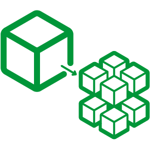
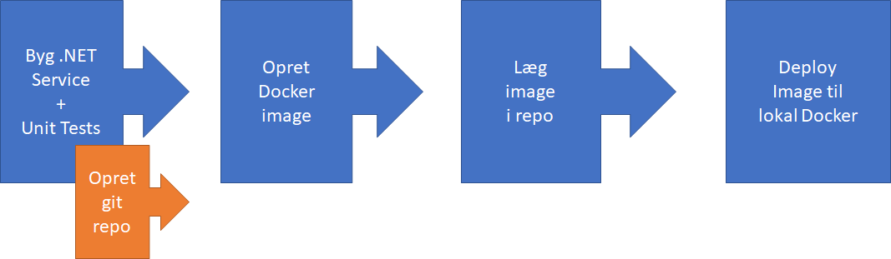

# Taxa Services



Denne fil indeholder information omkring hvordan en ny service oprettes med brug af en terminal, __dotnet__ cli, git, og docker.

> __Note:__
>  
> Instrukserne herunder er udført i en __git-bash__ terminal.
>  
> .

---



---

## Opret en ny .NET løsning & service projekter

Første trin af processen går ud på at oprette en .NET __solution__ og tilføje de nødvendige underprojekter som indeholder koden til vores service. Vi opretter også et projekt til vores unit-tests.

### 1. Opret en ny .NET __solution__

Fin en tom folder og opret en ny solution fil.

``` bash
~$ dotnet new sln -o my-service-solution
~$ cd my-service

```

### 2. Opret et projekt til service-koden

```bash
~$ dotnet new webapi -o my-new-service
~$ dotnet sln add ./my-new-service/my-new-service.csproj
```

### 3. Opret et projekt til __unit tests__

``` bash
~$ dotnet new nunit -o my-new-service.Test
~$ dotnet sln add ./my-new-service.Test/my-new-service.Test.csproj
~$ dotnet add ./my-new-service.Tests/my-new-service.Tests.csproj reference ./my-new-service/my-new-service.csproj

```

## Tilføj git support

Dette trin af processen, kræver at du har oprettet et git repository på GitHub eller lign.

```bash
~$ dotnet new gitignore
~$ git init
~$ git remote add origin https://github.com/MY-ACCTN/customer-service.git
~$ git branch -M main

~$ git add .
~$ git commit –am "Initial commit"

~$ git push -u origin main

```

---

## Afprøv den tomme løsning

### 1. Byg og kør servicen

Udfør følgende instrukser for at bygge og eksekvere service-programmet med webapi'en i.

```bash
~$ cd my-new-service
~$ dotnet build
~$ dotnet run
```

Brug en browser til at afprøve om endepunktet i projektet virker.
Brug __ctrl-c__ til at afbryde programmet

### 2. Kør unit testene

```bash
~$
~$ dotnet test
```

### 3. Publisér service projektet

```bash
~$ dotnet publish –c Release
```

---

## Opret et Docker image

### 1. Tilføj en __Dockerfile__

Tilføj en __Dockerfile__ til __my-new-service__ folderen  med følgende indhold:

```yaml
FROM mcr.microsoft.com/dotnet/sdk:6.0-alpine as build
WORKDIR /app

COPY . .
RUN dotnet restore
RUN dotnet publish -o /app/published-app

FROM mcr.microsoft.com/dotnet/aspnet:6.0-alpine as runtime
WORKDIR /app
COPY --from=build /app/published-app /app
ENTRYPOINT ["dotnet", "/app/my-new-service.dll"]

```

> Bemærk: navnet på __.dll__-filen i __ENTRYPOINT__ skal matche navnet på outputet fra __dotnet publish__ kommandoen. Typisk er dette navnet på projektfolderen.
> .

### 2. Byg docker image og gem i lokal docker-repo

Fra __my-new-service__-folderen:

```bash
~$ docker build -t my-new-service-image -f Dockerfile .
```

### 3. Tag det nye image

Du skal oprette et Docker Hub repository som matcher dit image navn -- f.eks. <min-konto>/my-new-service

```bash
~$ docker tag my-new-service-image <min-konto>/my-new-service:latest
```

### 4. Tilføj semantisk versioner (tags)

```bash
~$ docker tag my-new-service-image hnrkjnsn/my-new-service:1
~$ docker tag my-new-service-image hnrkjnsn/my-new-service:1.0
~$ docker tag my-new-service-image hnrkjnsn/my-new-service:1.0.0
```

### 5. Upload lokalle images til Docker Hub konto

Dette trin kræver at du har en Docker Hub konto og oprettet et repository til dine images.

```bash
~$ docker login
~$ docker push <min-konto>/my-new-service:latest
```

Gentag sidste instruks for de 3 andre udgaver af image'et.

---

## Deploy Image til lokal Docker Engine

Dette trin kræver at du har Docker Desktop kørende på din lokale udviklingsmaskine.

```bash
~$ docker run -d -p 8080:80 --name my-new-service-instance myaccountname/myreponame:my-new-service

```

---
